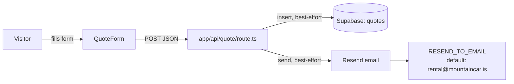

# ARCHITECTURE — mapa dla obcego (1 strona)

## Co to jest (3 zdania)
Next.js marketing site for Mountain Car, a car rental near Keflavík (KEF) airport, Iceland. The
rental business has since closed — the live business is now [garage.mountaincar.is](https://garage.mountaincar.is)
— so this site now runs as a demo/portfolio build with a farewell notice pointing visitors there
(see `docs/adr/0002-*.md`). Nobody logs in; the only write path is the public quote-request form.

## Stack (z package.json)
Next.js 16 (App Router) · React 19 · TypeScript 5 (`strict: true`) · Tailwind CSS 4 · `@supabase/supabase-js`
2.x (lead storage) · `resend` 6.x (transactional email) · Hosting: **Vercel** (push to `main` deploys —
there is no `vercel.json`, Next.js on Vercel doesn't need one). See ADR-0001 for why this stack.

## Modules and boundaries (what lives where)
| Path | Responsibility | Entry point | Tier |
|---|---|---|---|
| `app/layout.tsx` | Root HTML shell, fonts, SEO metadata, mounts `LangProvider` + global `FarewellModal` | — | T1 |
| `app/page.tsx` | Composes the one-page site from `components/*` in display order | — | T1 |
| `app/api/quote/route.ts` | The only server-side logic: validates a quote request, best-effort persists it to Supabase, best-effort emails it via Resend | `POST /api/quote` | T2 (handles customer PII: name/phone/email) |
| `components/*` | Presentational sections (`Hero`, `About`, `Fleet`, `Addons`, `Reviews`, `Location`, `CtaBanner`, `Footer`, `Navbar`, `WhatsAppButton`, `HowItWorks`, `Services`, `Values`) | one component per file | T1 |
| `components/QuoteForm.tsx` | The lead-capture form; posts JSON to `/api/quote` | — | T2 |
| `components/FarewellModal.tsx` | Rental-closed notice, dismissible per tab session, CTA to garage.mountaincar.is | — | T1 |
| `lib/i18n.tsx` | Client-side EN/PL/IS dictionary + `LangProvider`/`useT()`; language read via `useSyncExternalStore` so SSR always renders `en` (no hydration mismatch) | — | T1 |
| `lib/fleet-data.ts` | Single source of truth for the vehicle catalog — feeds both `Fleet` (display) and `QuoteForm` (dropdown) | `cars`, `vehicleNames` | T1 |
| `supabase/migrations/*.sql` | `quotes` table schema + RLS | — | T3 (customer PII + RLS) |

## Data flow — a quote request

Both the Supabase insert and the Resend send are **optional and independent**: each is skipped
silently if its env vars are unset (`getSupabase()` / `getResend()` return `null`), and the route
always answers `{ success: true }` once validation passes — it does not wait on either side effect
succeeding. See `docs/quality/BACKLOG.md` for the resulting silent-failure gap.

## Where is…
- **i18n / translations**: `lib/i18n.tsx` (dictionary + `useT()`); farewell-notice copy lives under the
  `farewell.*` keys in the same file.
- **the vehicle list**: `lib/fleet-data.ts` — edit here, both the Fleet section and the quote-form
  dropdown update together.
- **the quote-request pipeline**: `components/QuoteForm.tsx` (client) → `app/api/quote/route.ts`
  (server) → Supabase `quotes` table / Resend email.
- **secrets**: never in code — `.env.local` locally, Vercel project env vars in production (see
  `.env.example` for the full list with no values).
- **the rental-closed notice**: `components/FarewellModal.tsx`, mounted globally in `app/layout.tsx`.

## Decisions
See `docs/adr/`: 0001 (stack), 0002 (keep the site live as a demo after the rental closed).

## How to roll this back / kill switch
- Take the quote form out of service without deleting it: return an error/"temporarily unavailable"
  response early in `app/api/quote/route.ts` — do not just remove env vars, since a misconfigured
  Supabase/Resend already fails silently (see BACKLOG).
- Full rollback of a bad deploy: `git revert <sha> && git push` — Vercel redeploys `main` automatically.
